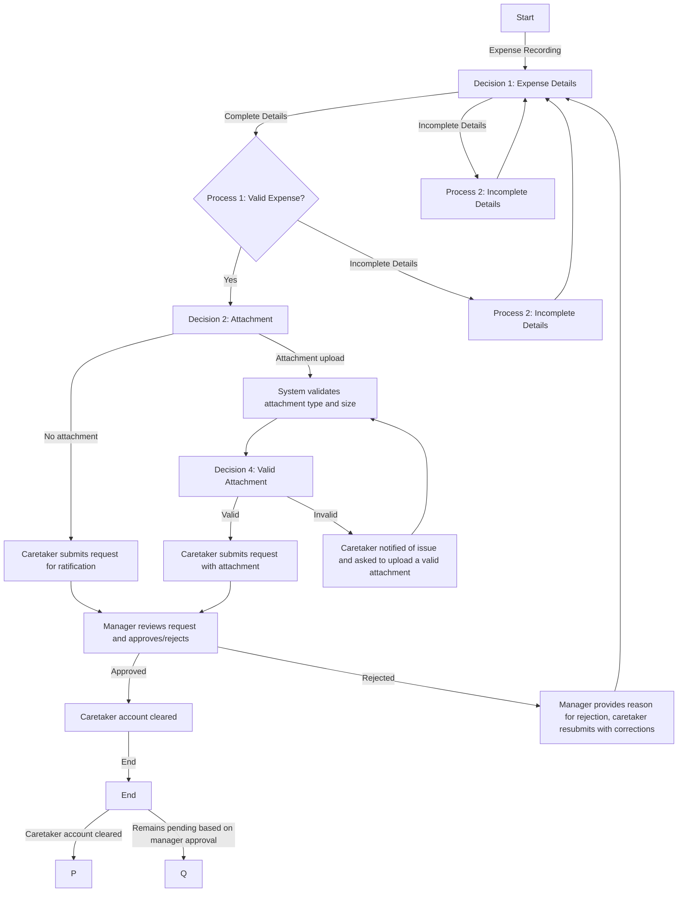

## Expense Recording and Ratification Flowchart

**Start:** Caretaker records an expense.
**(Decision 1: Expense Details)**
- **Complete details:**
    - **Process 1: Valid Expense:**
        - System validates expense information.
        - **(Decision 2: Attachment):**
            - **No attachment:**
                - Caretaker submits request for ratification.
                - Manager reviews request and approves/rejects.
                - **(Decision 3: Approval):**
                    - **Approved:** Caretaker account cleared.
                    - **Rejected:** Manager provides reason for rejection, caretaker resubmits with corrections.
            - **Attachment upload:**
                - System validates attachment type and size.
                - **(Decision 4: Valid Attachment):**
                    - **Valid:** Caretaker submits request with attachment.
                    - **Invalid:** Caretaker notified of issue and asked to upload a valid attachment
    - **Process 2: Incomplete Details:**
        - System prompts caretaker to provide missing information.
        - Caretaker completes details and returns to Process 1.
- **Incomplete details:**
    - System prompts caretaker to provide missing information.
    - Caretaker completes details and returns to Process 1.
**End:** Caretaker account cleared or remains pending based on manager approval.

