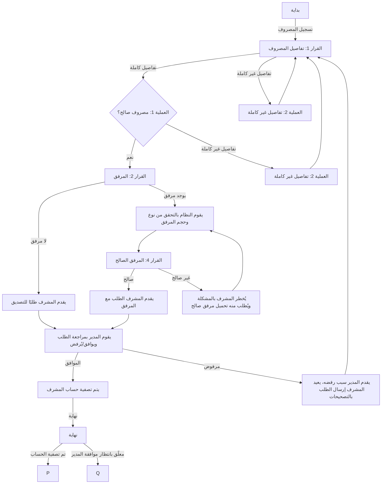

  
## مخطط سير سيناريو "تسجيل وتصديق المصروفات"

**البداية:** يسجل المشرف مصروفًا.

- **العملية 1: مصروف صالح:**
	- يقوم النظام بتحقق من معلومات المصروف.
	- **(القرار 2: المرفق):**
		- **لا يوجد مرفق:**
			- يقدم المشرف طلبًا للتصديق.
			- يراجع المدير الطلب ويوافق عليه او يرفضه.
			- **(القرار 3: الموافقة):**
				- **موافق:** يتم تصفية حساب المشرف.
				- **مرفوض:** يقدم المدير سبب رفضه، يعيد المشرف إرسال الطلب بالتصحيحات.
		- **تحميل المرفق (صورة, ملف):**
			- يقوم النظام بالتحقق من نوع وحجم المرفق.
			- **(القرار 4: المرفق الصالح):**
				- **صالح:** يقدم المشرف الطلب مع المرفق.
				- **غير صالح:** يُخطر المشرف بالمشكلة ويُطلب منه تحميل مرفق صالح.
- **العملية 2: تفاصيل غير كاملة:**
	- يطلب النظام من المشرف تقديم المعلومات المفقودة.
	- يكمل المشرف التفاصيل ويعود إلى العملية 1.

**النهاية:** يتم تصفية حساب المشرف أو يبقى معلّقًا بناءً على موافقة المدير.

